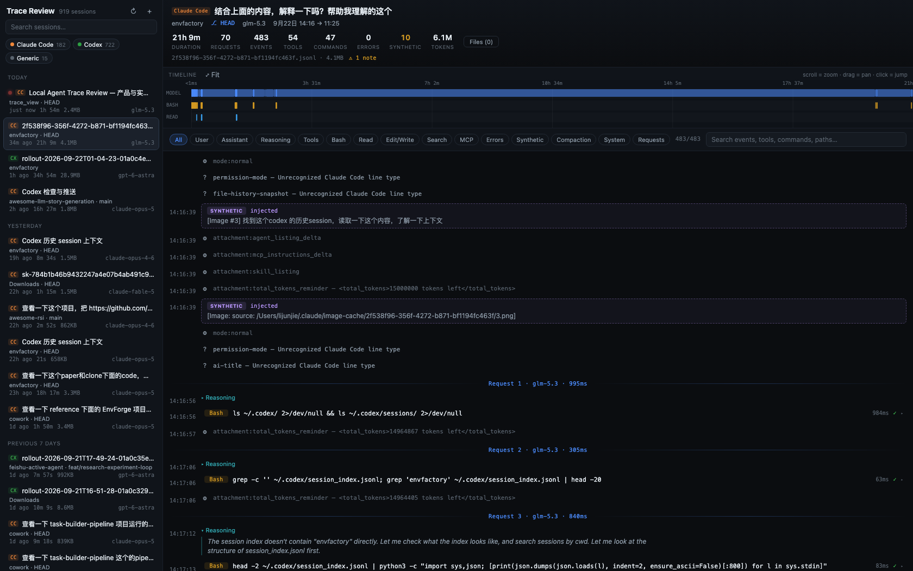

# Trace Review

**Local-first Agent Trace Review** — 一个用来查看、搜索、调试和 review Coding Agent 完整运行轨迹的开发者工具。

不是聊天记录查看器,而是 **Agent Run Inspector**:准确呈现 Agent "实际上是怎么运行的",而不只是它"说了什么"。



## 特性

| | |
|---|---|
| **Providers** | Claude Code(`~/.claude/projects`)、Codex CLI(`~/.codex/sessions`,支持 v0/v1/0.148 三代格式)、通用 `.jsonl`/`.ndjson` 手动导入 |
| **Session Library** | 自动扫描本地会话,provider 过滤、搜索、按日期分组、live 会话标记 |
| **Trajectory** | 虚拟滚动的完整轨迹:user/assistant/reasoning/tool call+result/system/error/compaction/unknown,连续工具调用自动聚合,可展开 |
| **Request Boundaries** | 每个 model request 一条分隔线(带模型名与耗时)——看清一个 run 到底拆了多少次真实请求 |
| **Synthetic 识别** | `(continuing)`、compact-summary、isMeta、injected 等 harness 合成消息全部标出,方便研究 harness 行为 |
| **Timeline** | Canvas 多 track 时间线(Model / Bash / Read / Edit / MCP…),zoom / pan / hover tooltip / 点击跳转事件 |
| **Search** | 服务端全文搜索:消息、工具参数、命令、输出、路径、request id |
| **Filters** | 14 个过滤 chip(User / Assistant / Reasoning / Tools / Bash / Read / Edit / MCP / Errors / Synthetic / …) |
| **Inspector** | 点击任意事件:元数据表、工具参数/结果、按需加载的原始 JSON(可折叠树 + copy) |
| **Files Changed** | 文件变更列表(±行数),点击跳回产生修改的 trace event |
| **Live Tail** | 正在运行的会话实时追加(fs.watch + SSE),truncate/rotate 自动全量重载 |
| **Token/Stats** | duration、requests、events、tools、commands、errors、synthetic、tokens(in/out/cache-read/cache-write/reasoning) |

**隐私**:完全本地运行(仅绑定 `127.0.0.1`),无 telemetry、无上传、无外部请求。trace 内容(源码、密钥、prompt)一律视为不可信输入:Markdown 渲染采用 escape-first 策略,链接仅允许 http(s),JSON 树通过 React 节点渲染,全站唯一一处 `dangerouslySetInnerHTML` 的输入已先行全量转义。

## 快速开始

**macOS(Apple Silicon)**:从 [Releases](https://github.com/Picrew/trace_view/releases) 下载 `Trace-Review-<ver>-arm64.dmg`,拖入 Applications 即可 — 自包含 Node 运行时,无需安装任何依赖。首次打开若被 Gatekeeper 拦截(未签名),右键 → 打开,或:

```bash
xattr -d com.apple.quarantine "/Applications/Trace Review.app"
```

**从源码运行**:

```bash
npm install
npm run build
npm start          # 启动并自动打开浏览器(127.0.0.1:7860)
```

或直接:

```bash
npx tsx src/cli.ts             # 开发模式(无需 build)
./bin/trace-review.mjs         # bin 入口(优先用 build 产物)
```

CLI 参数:

```
trace-review [--port 7860] [--no-open]
            [--claude-dir <path>]   # 默认 ~/.claude/projects
            [--codex-dir <path>]    # 默认 ~/.codex/sessions
            [--dir <path>]…         # 额外扫描目录(可重复)
```

开发模式(前端热更新 + API 热重载):

```bash
npm run dev        # vite(5173,代理 /api)+ tsx watch
```

测试与检查:

```bash
npm test           # 33 个测试(parsers / run-builder / API / UI 渲染 / live tail)
npm run typecheck  # server + web 双 tsconfig
npx tsx scripts/e2e-check.ts  # 真实浏览器 e2e(需 Chrome)
node scripts/bench-parse.ts    # 用本机最大的真实 trace 跑解析基准
npm run package:mac            # 打包 .app + .dmg(Node SEA 单文件,无需用户装 Node)
```

## 架构

```
~/.claude/projects   ~/.codex/sessions        手动导入
        └──────────────┬──────────────┘
                       ▼
        ClaudeAdapter / CodexAdapter / GenericAdapter     src/core/adapters/
                       ▼
             Unified Trace Schema (12 event kinds)        src/core/schema.ts
                       ▼
     ┌─────────────┬───────────────┬──────────────┐
     ▼             ▼               ▼              │
  SQLite-less    RunCache(LRU)   RunWatcher      │
  JSON cache     + parse          fs.watch+SSE   │
     └─────────────┴───────────────┴──────┬───────┘
                                          ▼
                    React UI(虚拟滚动 / Canvas timeline)web/
```

- **统一 Schema**:所有 provider 归一化为 12 种 event kind;每个 event 记录源文件字节偏移(`loc`),原始 JSON 按需读取,normalization 永不丢数据,未识别行保留为 `unknown`。
- **Adapter 契约**:`detect / createState / parseLine / finalize`,逐行解析 + 跨行状态(state),完整解析与 live tail 复用同一代码路径。
- **性能**:字节级 offset 流式读取;437MB 真实 trace 1.2s 解析完;UI 虚拟滚动 + 自适应截断(超大 run 降低预览预算)。
- **格式研究**:两代格式的逐字段结论见 `docs/trace-format-research.md`(基于本机真实样本,含 request boundary 推导、synthetic 识别规则、token 去重策略)。

## 项目结构

```
src/core/           统一 schema + adapters + run-builder(纯函数,可单测)
src/server/         http server / 扫描器 / RunCache / SSE watcher
src/cli.ts          CLI 入口
web/                React + Vite 前端
tests/              fixtures + 单测 + jsdom UI 渲染测试 + live tail 测试
docs/               格式研究文档、截图
bin/                trace-review 启动器
scripts/            dev / bench 脚本
```

## 设计决策记录

- **Web 优先,暂不打包 Tauri**:MVP 用 `127.0.0.1` 本地 server + 浏览器(需求文档允许的 fallback)。前端与 API 完全解耦(`fetch /api/*`),后续加 Tauri 壳只需把 `createTraceReviewServer()` 挂进 Tauri sidecar 或直接用其静态产物,无需改动 core。Rust 工具链已具备。
- **元数据缓存用 JSON 而非 SQLite**:`node:sqlite` 在当前 Node 上仍是实验性 API;缓存接口(`Library`)已隔离,替换为 SQLite 时不动业务代码。
- **Codex `event_msg` 以 `response_item` 为权威**:item_completed/token_count 等流式事件与 response_item 重复,仅提取 FileChange 与 token 用量,其余计入 warnings 不丢弃。

## Roadmap(V2+)

- [ ] DeepSeek Harness adapter
- [ ] Annotation(notes / suspicious / bug 标记,本地 SQLite 存储)
- [ ] Trace Compare(同一任务多 run 对比:duration / tokens / tools / diff)
- [ ] 自动异常检测(repeated command / file-read 循环 / token 激增)
- [ ] Subagent 树视图(跨文件 lineage 拼接)
- [ ] Tauri macOS 打包
